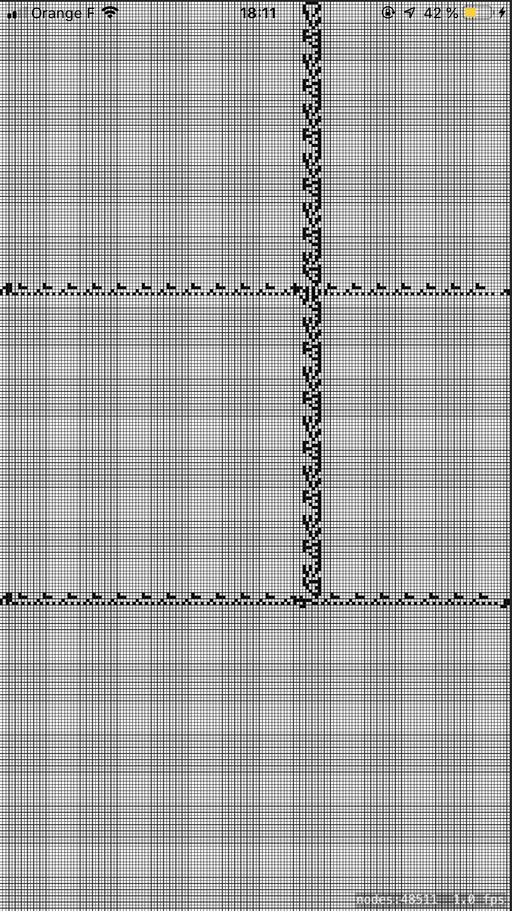
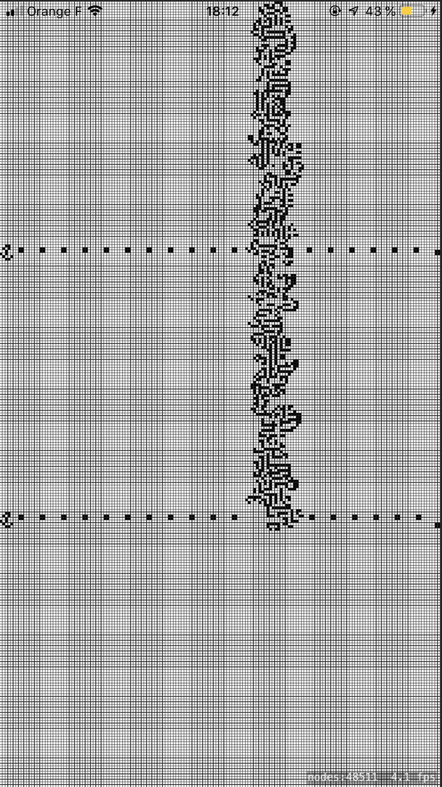
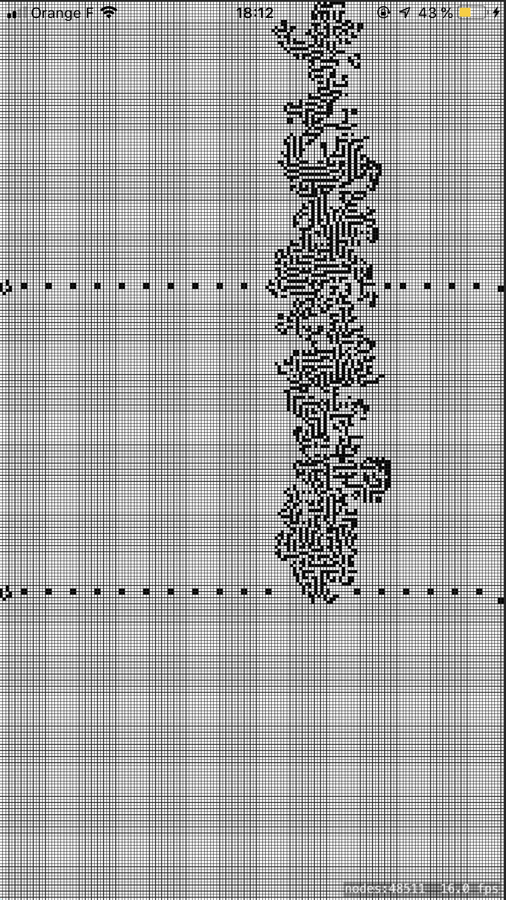
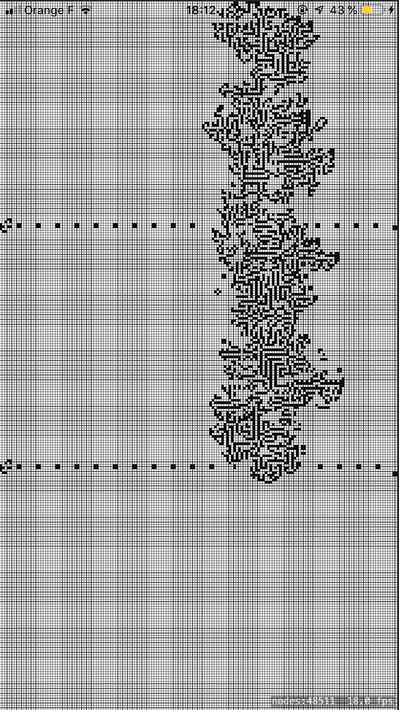
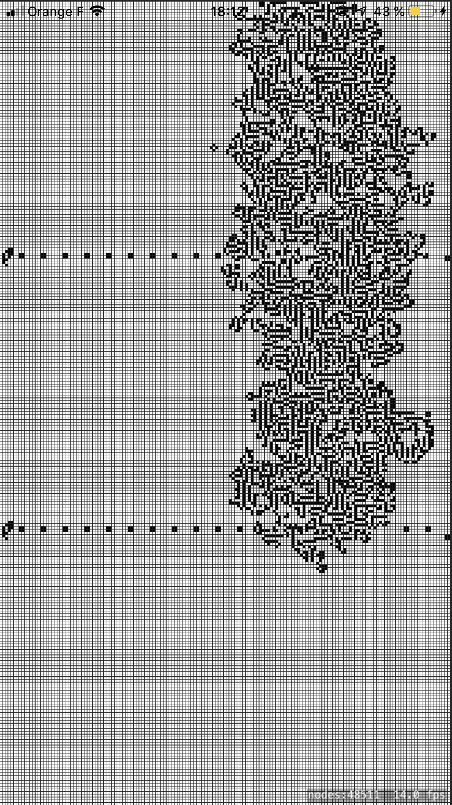
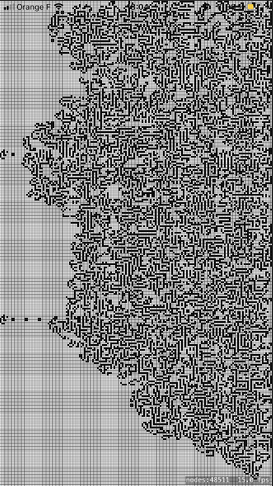
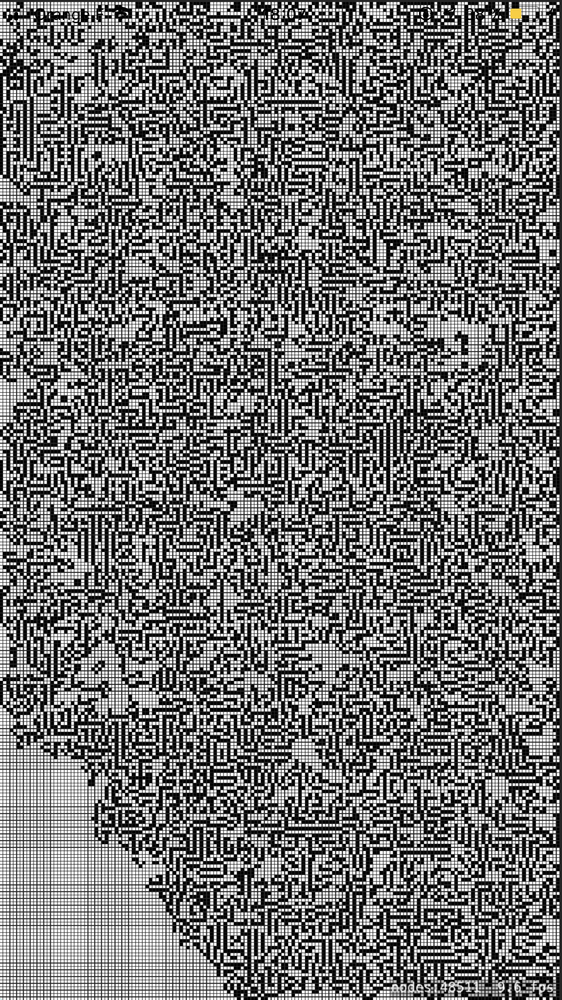
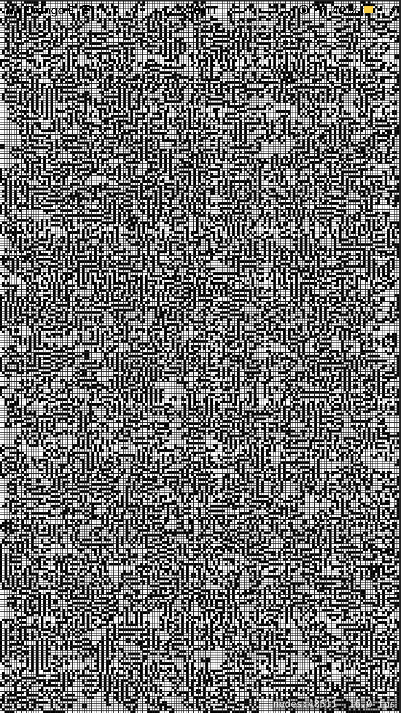

# GameOfLife-Swift :

    
    

Conway's Game of Life implementation in Swift using SpriteKi.

# Preview
## screenshots :

## config :

- 2px/cell
- 0.5px border
- Starting with living cells at : `X = 100` and `X = 200` and `Y = 100` and `Y = 200`
